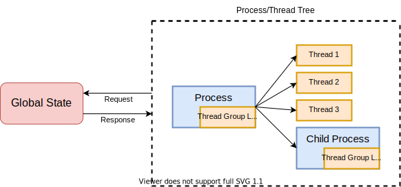

# Reverie

Reverie is a user space system-call interception framework for Linux. It can
be used to intercept, modify, or elide a syscall before the kernel executes
it. In essence, Reverie sits at the boundary between user space and kernel
space.

Some potential use cases include:

* Observability tools, like `strace`.
* Failure injection to test error handling logic.
* Manipulating scheduling decisions to expose concurrency bugs.

See the [`reverie-examples`](reverie-examples) directory for examples of
tools that can be built with this library.

## Features

 * Ergonomic syscall handling. It is easy to modify syscall arguments or return
   values, inject multiple syscalls, or suppress the syscall entirely.
 * Async-await usage allows blocking syscalls to be handled without blocking
   other guest threads.
 * Can intercept CPUID and RDTSC instructions.
 * Typed syscalls. Every syscall has a wrapper to make it easier to access
   pointer values. This also enables strace-like pretty-printing for free.
 * Avoid intercepting syscalls we don't care about. For example, if we only care
   about `sys_open`, we can avoid paying the cost of intercepting other
   syscalls.
 * Can act as a GDB server. This allows connection via the GDB client where you
   can step through the process that is being traced by Reverie.

## Terminology and Background

Clients of the Reverie library write ***tools***. A tool runs a shell command
creating a ***guest*** process tree, comprised of multiple guest threads and
processes, in an instrumented manner. Each Reverie tool is written as a set
of callbacks (i.e. ***handlers***), which are invoked each time a guest
thread encounters a trappable event such as a system call or inbound signal.
The tool can stipulate exactly which events streams it ***subscribes*** to.
The tool itself is stateful, maintaining state between consecutive
invocations.

## Usage

Currently, there is only the `reverie-ptrace` backend which uses `ptrace` to
intercept syscalls. Copy one of the example tools to a new Rust project (e.g.
`cargo init`). You’ll see that it depends both on the general `reverie` crate
for the API and on the specific backend implementation crate,
`reverie_ptrace`.

## Performance

Since `ptrace` adds significant overhead when the guest has a syscall-heavy
workload, Reverie will add similarly-significant overhead. The slowdown depends
on how many syscalls are being performed and are intercepted by the tool.

The primary way you can improve performance with the current implementation is
to implement the `subscriptions` callback, specifying a minimal set of syscalls
that are actually required by your tool.

## Overall architecture

When implementing a Reverie tool, there are three main components of the tool to
consider:

* The process-level state,
* the thread-level state, and
* the global state (which is shared among all processes and threads in the
  traced process tree).

This separation of process-, thread-, and global-state is meant to provide an
abstraction that allows future Reverie backends to be used without requiring the
tool to be rewritten.

   

### Process State

Whenever a new process is spawned (i.e., when `fork` or `clone` is called by the
guest), a new instance of the process state struct is created and managed by the
Reverie backend.

### Thread State

When a syscall is intercepted, it is always associated with the thread that
called it.

### Global State

The global state is accessed via RPC messages. Since a future Reverie backend
may use in-guest syscall interception, the syscall handler code may not be
running in the same address space. Thus, all shared state is communicated via
RPC messages. (There is, however, currently only a single ptrace-based backend
where all tracer code is in the same address space.)

## Platform and Architecture Support

Reverie currently only supports the following platforms and architectures:

| Platform | Architecture | Notes                                     |
|:--------:|:------------:|:------------------------------------------|
| Linux    | x86-64       | Full support                              |
| Linux    | aarch64      | Missing timers & cpuid/rdtsc interception |

Other platforms and architectures are currently unplanned.

## Future Plans

 * Add a more performant backend. The rough goal is to have handlers executing in
   the guest with close to regular functional call overhead. Global state and its
   methods will still be centralized, but the RPC/IPC mechanism between guest &
   the centralized tool process will become much more efficient.

## Contributing

Contributions are welcome! Please see the [CONTRIBUTING.md](CONTRIBUTING.md)
file for guidance.

## License

Reverie is BSD 2-Clause licensed as found in the [LICENSE](LICENSE) file.
