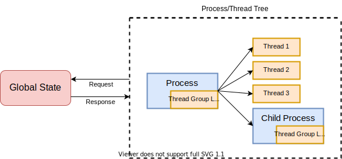

# Reverie

Reverie is a user space system-call interception framework for Linux. It can
be used to intercept, modify, or elide a syscall before the kernel executes
it. In essence, Reverie sits at the boundary between user space and kernel
space.

Some potential use cases include:

* Observability tools, like `strace`.
* Failure injection to test error handling logic.
* Manipulating scheduling decisions to expose concurrency bugs.

See the [`reverie-examples`](reverie-examples) directory for examples of
tools that can be built with this library.

## Features

 * Ergonomic syscall handling. It is easy to modify syscall arguments or return
   values, inject multiple syscalls, or suppress the syscall entirely.
 * Async-await usage allows blocking syscalls to be handled without blocking
   other guest threads.
 * Can intercept CPUID and RDTSC instructions.
 * Typed syscalls. Every syscall has a wrapper to make it easier to access
   pointer values. This also enables strace-like pretty-printing for free.
 * Avoid intercepting syscalls we don't care about. For example, if we only care
   about `sys_open`, we can avoid paying the cost of intercepting other
   syscalls.
 * Can act as a GDB server. This allows connection via the GDB client where you
   can step through the process that is being traced by Reverie.

## Terminology and Background

Clients of the Reverie library write ***tools***. A tool runs a shell command
creating a ***guest*** process tree, comprised of multiple guest threads and
processes, in an instrumented manner. Each Reverie tool is written as a set
of callbacks (i.e. ***handlers***), which are invoked each time a guest
thread encounters a trappable event such as a system call or inbound signal.
The tool can stipulate exactly which events streams it ***subscribes*** to.
The tool itself is stateful, maintaining state between consecutive
invocations.

A ***backend*** is the other half of the picture. Where a tool decides *what*
to do on each event, a backend decides *how* those events are trapped and how
the tool is actually run against a live guest: it spawns and supervises the
guest process tree, intercepts syscalls (and other trappable events), routes
each event to the tool's handlers, hosts the tool's global state, and tears
everything down at exit. `reverie-ptrace` is the reference backend. A backend is
a *swappable implementation* — anything playing the same role as
`reverie-ptrace` — and it must be able to host an **arbitrary** tool, not a
hard-coded one. See [The Backend Contract](#the-backend-contract) below.

## Building and Testing

Reverie needs the following system-level dependencies:
```text
sudo apt install pkg-config libunwind-devel
```
(These are required to get backtraces from the guest process.)

To test, run:
```text
cargo test -- --test-threads=1
```

To run the `strace` example:
```text
cd reverie-examples
cargo run --bin strace -- ls
```

## Usage

Currently, there is only the `reverie-ptrace` backend which uses `ptrace` to
intercept syscalls. Copy one of the example tools to a new Rust project (e.g.
`cargo init`). You’ll see that it depends both on the general `reverie` crate
for the API and on the specific backend implementation crate,
`reverie_ptrace`.

Running a tool always follows the same shape: pick a backend, hand it a command
and the tool's config, and receive the guest's exit status together with the
tool's final global state. With the ptrace backend's builder:

```rust
// `MyTool: reverie::Tool`
let tracer = reverie_ptrace::TracerBuilder::<MyTool>::new(command)
    .spawn()
    .await?;
let (exit_status, global_state) = tracer.wait().await?;
```

The same run, expressed through the abstract `reverie::Backend` trait (which any
backend implements — `reverie_ptrace::PtraceBackend` is the reference impl):

```rust
use reverie::Backend;
let (exit_status, global_state) =
    reverie_ptrace::PtraceBackend::run::<MyTool>(command, config).await?;
```

## Performance

Since `ptrace` adds significant overhead when the guest has a syscall-heavy
workload, Reverie will add similarly-significant overhead. The slowdown depends
on how many syscalls are being performed and are intercepted by the tool.

The primary way you can improve performance with the current implementation is
to implement the `subscriptions` callback, specifying a minimal set of syscalls
that are actually required by your tool.

## Overall architecture

When implementing a Reverie tool, there are three main components of the tool to
consider:

* The process-level state,
* the thread-level state, and
* the global state (which is shared among all processes and threads in the
  traced process tree).

This separation of process-, thread-, and global-state is meant to provide an
abstraction that allows future Reverie backends to be used without requiring the
tool to be rewritten.

<p align="center">
   
</p>

### Process State

Whenever a new process is spawned (i.e., when `fork` or `clone` is called by the
guest), a new instance of the process state struct is created and managed by the
Reverie backend.

### Thread State

When a syscall is intercepted, it is always associated with the thread that
called it.

### Global State

The global state is accessed via RPC messages. Since a future Reverie backend
may use in-guest syscall interception, the syscall handler code may not be
running in the same address space. Thus, all shared state is communicated via
RPC messages. (There is, however, currently only a single ptrace-based backend
where all tracer code is in the same address space.)

## The Backend Contract

The architecture above describes the tool author's view. This section describes
the **backend author's** view: what you must build to create a new backend that
is a drop-in peer of `reverie-ptrace`.

A backend is *not* a tool, and it is *not* a mere building block such as a bare
VM, a sandbox, or a binary rewriter. A backend is a complete implementation of
process supervision and event interception that can host an **arbitrary**
`T: Tool`. The tool type is always a generic parameter — never hard-coded — so
the same backend can run a syscall counter, an `strace`, a fault injector, or
any other tool without modification.

Concretely, given a command to run and the tool's static configuration, a
backend must:

1. **Initialize the global state.** Call `GlobalTool::init_global_state` once
   for the whole guest tree, and keep that singleton reachable (for RPC) for the
   lifetime of the run.
2. **Compute subscriptions.** Call `Tool::subscriptions` once and trap exactly
   the event streams the tool asked for — no more (correctness/perf), no less.
3. **Spawn and supervise the guest.** Start the command as the root guest
   process and manage its entire process/thread tree across
   `fork`/`clone`/`vfork` and `execve`, including stdio.
4. **Allocate per-process and per-thread state.** Call `Tool::new` for each new
   process and `Tool::init_thread_state` for each new thread, at the points
   documented on those methods.
5. **Route every subscribed event to the tool.** Drive the tool's handlers —
   `handle_syscall_event`, `handle_signal_event`, `handle_thread_start`,
   `handle_post_exec`, `handle_timer_event`, and (on x86-64, when subscribed)
   `handle_cpuid_event` / `handle_rdtsc_event` — passing each a `Guest` handle
   through which the tool inspects/mutates the guest and talks to global state.
6. **Run destructors.** Call `Tool::on_exit_thread` and `Tool::on_exit_process`
   as threads and processes wind down.
7. **Return `(ExitStatus, T::GlobalState)`.** When the root guest exits, hand
   back its exit status together with the (now uniquely owned) global state, so
   the caller can read out whatever the tool accumulated.

This contract is captured explicitly by the `reverie::Backend` trait:

```rust
#[reverie::backend(?Send)]
pub trait Backend {
    async fn run<T: Tool + 'static>(
        command: Command,
        config: <T::GlobalState as GlobalTool>::Config,
    ) -> Result<(ExitStatus, T::GlobalState), Error>;
}
```

`reverie::Backend::run` is the *minimal common denominator* every backend must
provide. A real backend will typically also expose a richer, backend-specific
builder: `reverie-ptrace`, for example, additionally supports output capture, a
GDB server, and spawning a *function* (rather than a `Command`) under
instrumentation, via its `TracerBuilder`/`Tracer` API.

`reverie-ptrace` is the reference implementation. It is a *centralized* backend:
because it traps events from outside the guest via `ptrace` + `seccomp`, it can
keep all tool state in the tracer's address space. A future in-guest backend
(e.g. binary rewriting) would run handlers inside the guest and communicate with
centralized global state over RPC — but it would satisfy the exact same
`Backend` contract, which is what lets tools move between backends unchanged.

## Platform and Architecture Support

Reverie currently only supports the following platforms and architectures:

| Platform | Architecture | Notes                                     |
|:--------:|:------------:|:------------------------------------------|
| Linux    | x86-64       | Full support                              |
| Linux    | aarch64      | Missing timers & cpuid/rdtsc interception |

Other platforms and architectures are currently unplanned.

## Future Plans

 * Add a more performant backend. The rough goal is to have handlers executing in
   the guest with close to regular functional call overhead. Global state and its
   methods will still be centralized, but the RPC/IPC mechanism between guest &
   the centralized tool process will become much more efficient.

## Contributing

Contributions are welcome! Please see the [CONTRIBUTING.md](CONTRIBUTING.md)
file for guidance.

## License

Reverie is BSD 2-Clause licensed as found in the [LICENSE](./LICENSE) file.
